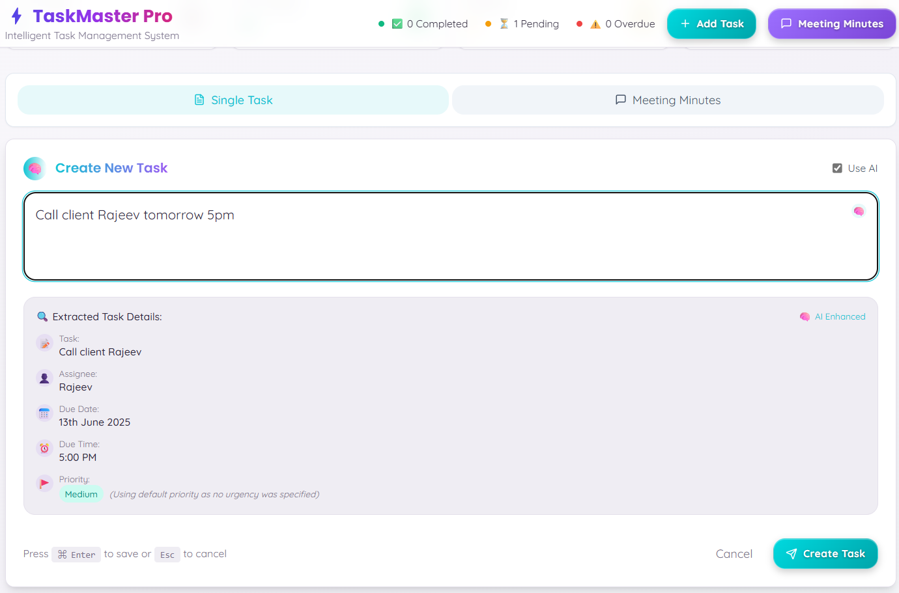
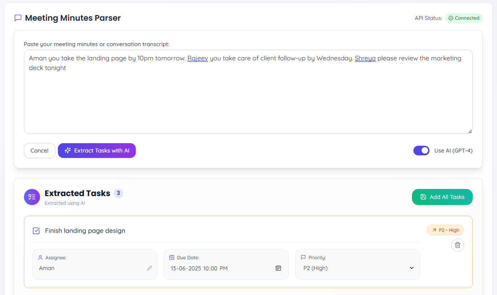

# TaskMaster Pro ⚡

> **The Intelligent Task Management System for Modern Teams**

TaskMaster Pro transforms the way you manage tasks and meeting minutes. Powered by advanced Natural Language Processing (NLP) and optional AI integration, it turns your everyday language into actionable, organized tasks—so you can focus on what matters.

---

## 📑 Table of Contents
- [Features](#features)
- [Screenshots](#screenshots)
- [Quick Start](#quick-start)
- [AI & NLP Configuration](#ai--nlp-configuration)
- [Usage](#usage)
- [Tech Stack](#tech-stack)
- [Contributing](#contributing)
- [License](#license)
- [Support](#support)

---

## ✨ Features
- **📝 Natural Language Task Entry**: Add tasks in plain English (e.g., "Email Sarah by Friday 3pm, high priority").
- **🤖 AI-Powered Parsing**: Extracts title, assignee, due date, and priority using OpenAI GPT (optional).
- **🗒️ Meeting Minutes to Tasks**: Paste meeting notes and auto-extract multiple actionable tasks.
- **🧠 Local NLP Fallback**: Works offline with built-in NLP if no API key is provided.
- **📅 Smart Date Handling**: Intelligently sets future dates, even without a year.
- **🔎 Powerful Filtering & Sorting**: Filter by assignee, priority, status, or search terms. Sort by due date, priority, or assignee.
- **🖱️ Intuitive Editing**: Edit all task properties in a modern modal interface.
- **📱 Responsive Design**: Beautiful on desktop and mobile.
- **💾 Local Storage**: All tasks saved securely in your browser.
- **🎨 Modern UI**: Clean, animated, and easy to use.

---

## 📸 Screenshots

| Task Creation (NLP) | Meeting Minutes Parser | Task Dashboard |
|:-------------------:|:---------------------:|:--------------:|
|  |  | *(Add dashboard screenshot)* |

---

## 🚀 Quick Start

### Prerequisites
- Node.js v16+
- npm or yarn

### Installation
```bash
# Clone the repository
git clone https://github.com/SusmithaK07/AI-Meeting-Minutes-to-Task-Converter.git
cd Natural-Language-Task-Manager

# Install dependencies
npm install

# Start the development server
npm run dev
```

Open [http://localhost:5173](http://localhost:5173) in your browser.

---

## 🔑 AI & NLP Configuration

TaskMaster Pro can use OpenAI's GPT model for enhanced parsing. To enable:

1. Create a `.env` file in the project root.
2. Add your API key:
   ```env
   VITE_OPENAI_API_KEY=your_api_key_here
   ```
3. Toggle the "Use AI" switch in the app UI.

> **No API key?** No problem! The app automatically uses its built-in NLP parser for offline/local use.

---

## 🛠️ Usage

### Add a Single Task
1. Click **Add Task**
2. Type: `Call John about the project proposal tomorrow at 2pm`
3. (Optional) Toggle **Use AI** for GPT parsing
4. Submit (Ctrl+Enter or click Submit)

### Parse Meeting Minutes
1. Click **Meeting Minutes**
2. Paste your transcript or notes
3. Click **Parse Meeting Minutes**
4. Review, edit, and **Add All Tasks**

---

## 💡 Tech Stack
- **Frontend**: React (TypeScript)
- **Styling**: Tailwind CSS, shadcn-ui
- **State**: React Hooks, Context API
- **AI**: OpenAI API (optional)
- **Routing**: React Router
- **Build**: Vite

---

## 🤝 Contributing

Contributions are welcome! To get started:
1. Fork the repo
2. Create a new branch (`git checkout -b feature/your-feature`)
3. Commit your changes
4. Open a Pull Request

---

## 📄 License

This project is licensed under the MIT License. See [LICENSE](LICENSE) for details.

---

## 💬 Support & Feedback

- Found a bug? [Open an issue](https://github.com/SusmithaK07/AI-Meeting-Minutes-to-Task-Converter/issues)
- Have a feature request? [Start a discussion](https://github.com/SusmithaK07/AI-Meeting-Minutes-to-Task-Converter/discussions)
- Questions? Contact the maintainer via GitHub

---

> **TaskMaster Pro** — Your intelligent assistant for effortless, organized productivity.


